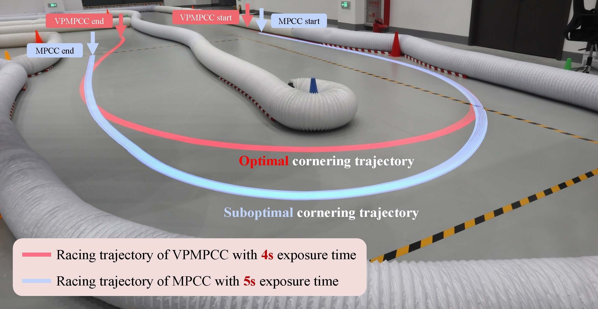
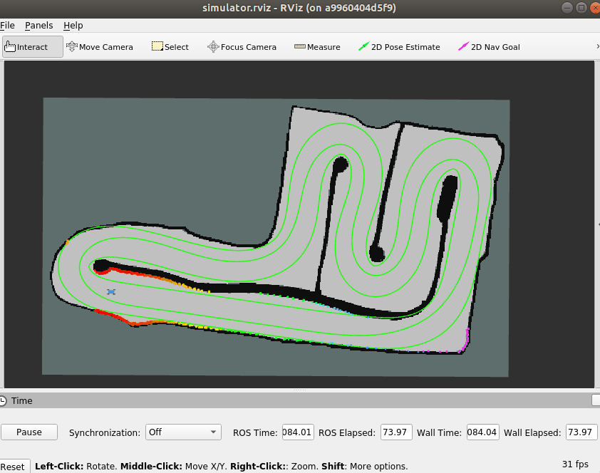

# 🏎️ Local Trajectory Planning with Velocity Prediction

Deploy and visualize the trajectory planner from ICRA 2025 paper "[A Data-Driven Aggressive Autonomous Racing Framework Utilizing Local Trajectory Planning with Velocity Prediction](https://arxiv.org/pdf/2410.11570)". The main branch contains the F1tenth simulator and the VPMPCC planner.

<div style="display: flex; justify-content: space-between; align-items: center;">
  
  
</div>

## 🪄 Quickstart

The ROS environment for the current branch is neotic under Ubuntu 20.04. Two methods are provided to configure the runtime environment:

1. Run directly using the pre-built Docker image.
2. Reconfigure from scratch using Docker.

Start by cloning this repository to the host:

```bash
git clone https://github.com/zhouhengli/VPMPCC.git f1tenth_ws
```

## 🛠️ Configure

Either of the following two methods can be used to deploy the environment.

### ✅ Run directly using the pre-built Docker image

Alternatively, the Docker configuration can be pulled from [TBA](TBA). Simply download it to your Linux system.

**[1/2]** Import the `prebuilt_vpmpcc_v1.0.tar` file as a new image using Docker import:

```
docker import prebuilt_vpmpcc_v1.0.tar prebuilt_vpmpcc_v1.0
```

**[2/2]** Now, you can use the imported image to create and launch a new container:

```
sudo docker run -it \
  -v /tmp/.X11-unix:/tmp/.X11-unix \
  -e DISPLAY=$DISPLAY \
  -v <host_path>/f1tenth_ws:/home/ddrx/f1tenth_ws \
  -w /home/ddrx/f1tenth_ws \
  prebuilt_vpmpcc_v1.0 \
  /bin/bash
```
### ✅ [Optional] Reconfigure from scratch using Docker

**[1/3]** Pull Docker image:

```bash
sudo docker pull ros:noetic-robot-focal
```

**[2/3]** Set up a container:

```bash
sudo docker run -it \
  -v /tmp/.X11-unix:/tmp/.X11-unix \
  -e DISPLAY=$DISPLAY \
  -v <host_path>/f1tenth_ws:/home/ddrx/f1tenth_ws \
  ros:noetic-robot-focal \
  /bin/bash
```

**[3/3]** Set up the necessary dependencies in the corresponding container using the bash script:

``` bash
cd /home/ddrx/f1tenth_ws/
chmod +x setup_env.sh
./setup_env.sh
```

### 🚀 Planning

**[1/3]** Set up a container and enter the following commands. After the final command, the map should pop up:

```bash
source /opt/ros/noetic/setup.bash && source /home/ddrx/f1tenth_ws/devel/setup.bash
./toolkit/sim_setup.sh -n mapwheV1
```

[Optional] If the RViz interface does not appear and there is an error `qt.qpa.xcb: could not connect to display :0`, it may be because Docker does not have access to the display server.
Try the following command in the host machine: `xhost +local:docker`.

**[2/3]** Start a new container and run the VPMPCC planner:

```bash
sudo docker exec -it <CONTAINER ID> /bin/bash
export PYTHONPATH=$PYTHONPATH:/home/ddrx/f1tenth_ws/toolkit/casadi/
source /opt/ros/noetic/setup.bash && source /home/ddrx/f1tenth_ws/devel/setup.bash
roslaunch nonlinear_mpc_casadi ddrx_nmpcc.launch
```

[Optional] For a real vehicle, change the param `is_sim = False` in `./params/ddrx_unified_params.yaml`.

**[3/3]** Use the '2D Nav Goal' as the starting signal for racing.

<div style="display: flex; justify-content: space-between; align-items: center;">
  
  
</div>

## 💻 Customization

This project allows for the customization of the map and track files used by the VPMPCC method, as well as the parameters. Adjustments can be made according to specific needs.

Before modifying them, replace the `home_dir` in `./params/ddrx_unified_params.yaml` with the path to the track files. 

### ✏️ Customized map and track

Maps files can be found in `toolkit/maps/`, and the map in this project is generated using Cartographer.

Track files are located in `toolkit/tracks/`, where path and boundaries are defined as a closed curve, and `<track_name>_center_derivates.csv` defines the deviations in the x and y directions. The third column is reference velocity profile (RVP), which is generated using [this method](https://github.com/ForzaETH/global_racetrajectory_optimization/tree/d49ac768e6bf39b57f9e9dd25d42f5075e1f8105).

### ✏️ Parameter Tuning

Parameter files are saved in `toolkit/params/`, where the parameter definitions are consistent with those described in the [paper](https://arxiv.org/pdf/2410.11570). 


## 🤗 Acknowledgments

Many thanks to the excellent open-source repositories listed below:

- [Nonlinear_MPCC_for_autonomous_racing](https://github.com/nirajbasnet/Nonlinear_MPCC_for_autonomous_racing)
- [ForzaETH/race_stack](https://github.com/ForzaETH/race_stack)
- [Minimum Curvature Trajectory Planning](https://github.com/ForzaETH/global_racetrajectory_optimization/tree/d49ac768e6bf39b57f9e9dd25d42f5075e1f8105)
- [Cartographer](https://github.com/cartographer-project/cartographer)
- [CasADi](https://web.casadi.org/)

Please contact [Zhouheng Li](https://zhouhengli.github.io) if you have any questions or suggestions.

## 📑 Citations

If you find our work useful, please consider citing:

```
@article{li2024data, 
  title={A Data-Driven Aggressive Autonomous Racing Framework Utilizing Local Trajectory Planning with Velocity Prediction}, 
  author={Li, Zhouheng and Zhou, Bei and Hu, Cheng and Xie, Lei and Su, Hongye}, 
  journal={arXiv preprint arXiv:2410.11570}, 
  year={2024}
}
```

